# Multica + Trellis：AI Agent 协作开发实践分享

分享人：马旭  
时间：2026.5.14  
文档类型：内部技术分享文稿

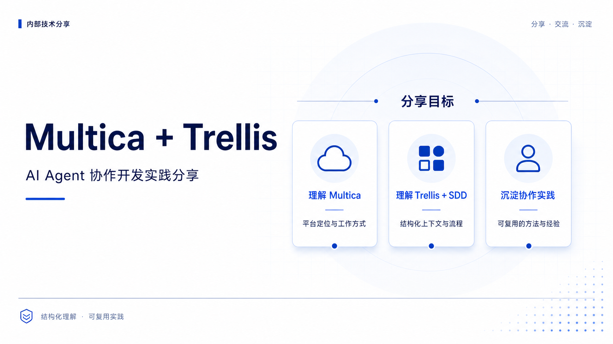

## 一、分享目标

本文用于内部技术分享，目标不是完整介绍两个开源项目的全部能力，而是围绕实际协作开发场景，说明以下三件事：

- Multica 解决的核心问题是什么，以及其基本工作方式
- Trellis 与 SDD 如何补足单个 Agent 的执行可靠性
- 在真实使用中，哪些实践能够显著提升多 Agent 协作的稳定性与可控性

本文侧重结构化理解与方法沉淀，不以产品宣传为导向，也不展开与当前分享目标无关的实现细节。

| 章节 | 核心问题 | 建议关注点 |
|---|---|---|
| 背景 | 为什么单 Agent 模式不足以支撑团队协作 | 任务并行、角色拆分、状态追踪 |
| Multica 平台概览 | 平台负责什么，不负责什么 | 云端调度、本地执行、角色化 Agent |
| Trellis 与 SDD | 为什么需要结构化上下文与流程 | Spec、任务上下文、三阶段工作流 |
| 联合工作流 | 两者如何组合形成闭环 | Spec → Plan → 执行 → 审查 → 沉淀 |
| 实践经验 | 哪些机制真正影响稳定性 | 文件化上下文、执行与评估分离、异常恢复 |

## 二、背景：为什么需要多 Agent 协作

传统 AI 编程工作流通常以单轮 Prompt 为中心：人工组织上下文，将任务交给单个 CLI Agent 执行，等待结果，再进入下一轮交互。这种模式在个人场景下已经具备较高效率，但在任务并行、角色分工、状态追踪和上下文延续方面存在明显瓶颈。

从工程协作视角看，问题并不在于单个模型能力不足，而在于缺少一套面向团队和流程的协调机制。当需求分析、编码实现、测试验证、代码审查等工作需要同时推进时，人工调度会迅速成为系统瓶颈。

因此，多 Agent 协作的关键价值并不是“同时调用多个模型”，而是将分析、实现、验证、调度等职责显式拆分，并为这些职责提供统一的任务入口、状态流转机制和上下文承接能力。

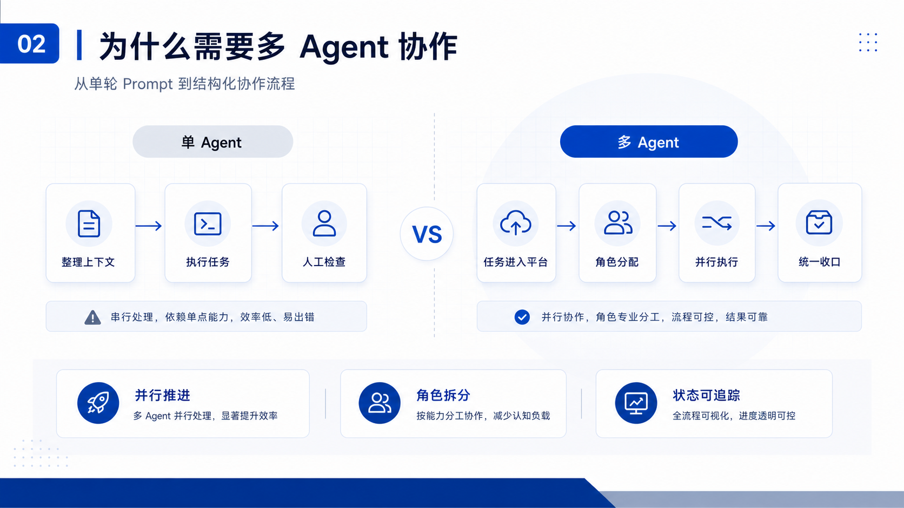

在这一语境下，多 Agent 协作更接近一种工程组织方式：由平台承担调度和状态同步，由不同 Agent 按角色承担具体职责，由人控制目标、边界与验收标准。

| 维度 | 单 Agent / 单轮 Prompt | 多 Agent 协作 |
|---|---|---|
| 任务推进方式 | 以串行为主 | 可并行推进 |
| 上下文维护 | 人工手动承接 | 平台与文件共同承接 |
| 角色边界 | 分析、实现、验证经常混在一起 | 角色职责可显式拆分 |
| 状态可见性 | 主要依赖终端输出 | 可通过任务系统统一追踪 |
| 质量控制 | 依赖人工临时判断 | 可流程化、可机械化验证 |

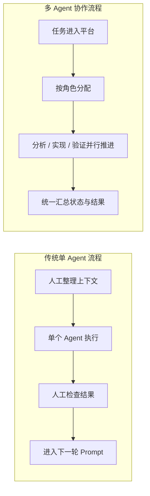

## 三、Multica 平台概览

### 3.1 Multica 是什么

Multica 是一个开源的多 Agent 协作平台。一句话定义：**把 AI Agent 从终端里的临时工具，变成任务系统中可以协作的团队成员。**

具体来说：你在 Multica 的看板上创建 Issue、分配给 Agent，Agent 就像同事一样自动领取任务、执行代码、评论汇报进展。它不绑定某个模型——底层支持 11 种 Agent CLI（Claude Code、Codex、GitHub Copilot、Cursor Agent、Gemini 等），执行者随时可以替换。Agent 是”稳定的角色抽象”（Coder、Reviewer、Master Orchestrator），而不是”固定绑定某个模型的实例”。

### 3.2 Multica 解决什么问题

| 协作痛点 | 传统处理方式 | Multica 的处理方式 |
|---|---|---|
| 上下文重复传递 | 每轮重新整理并复制粘贴 | 任务在 Issue 内持续流转 |
| 执行过程不可见 | 依赖终端人工观察 | 通过评论、状态和实时输出追踪 |
| 多任务难并行 | 人工逐个调度 | 通过 Runtime 与 Agent 并发处理 |
| 角色分工不清 | 一个 Agent 兼顾多种职责 | 按角色创建并分配不同 Agent |
| 会话延续困难 | 中断后依赖人工回顾 | 平台提供 session 恢复与状态承接 |

### 3.3 核心概念

理解以下五个概念即可覆盖大部分协作场景：

- `Workspace`：多租户隔离边界，所有资源在其中组织
- `Issue`：核心工作单元，人类与 Agent 共享的任务载体
- `Agent`：绑定了名称、运行时、技能和执行指令的 AI 执行角色
- `Runtime`：真正执行任务的计算环境，通常由本地守护进程提供
- `Skill`：执行前注入到工作目录中的 Markdown 指令资产，用于沉淀团队知识

另外两个辅助概念：`Autopilot` 允许调度周期性任务（如每日缺陷分类）；`Chat` 提供在 Issue 上下文之外与 Agent 进行持久化多轮对话的能力。

### 3.4 工作原理：云端调度，本地执行

Multica 采用三层分离架构：前端界面（Web + Desktop）、后端协调层（Go + PostgreSQL）、本地执行层（Daemon + CLI）。平台负责的是协作控制面，而不是代码执行面——**你的代码和 API Key 留在本地，不经过云端。**

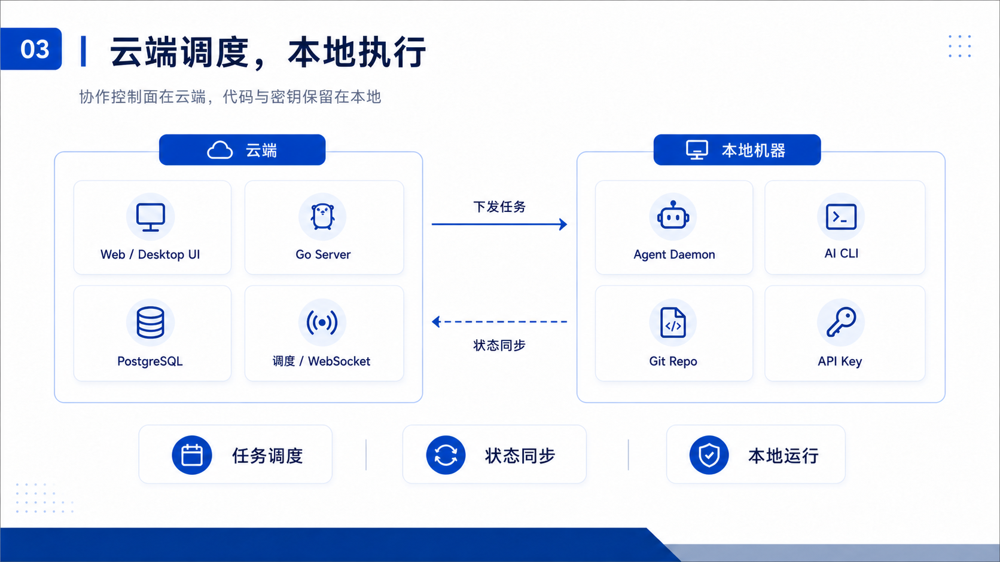

职责划分：

- **云端**：Web 界面、Issue 与评论数据、Agent 配置、任务调度、WebSocket 状态同步
- **本地**：守护进程运行、AI CLI 调用、Git 仓库读写、API Key 保管

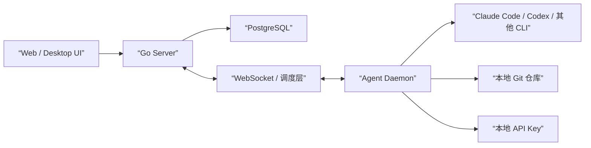

这里容易混淆的一点是 Skill 和 MCP 的关系。简单说：**CLI 是执行者，Skill 是工作手册，MCP 是工具扩展。** 任务开始时，平台把 Skill（Markdown 指令）注入到工作目录，CLI 读取后按规范执行；MCP 则为 CLI 提供数据库、内部 API 等外部系统的访问能力。三者是协作关系，不是替代关系。

### 3.5 平台原生能力

围绕协作稳定性，Multica 提供了一整套基础设施：

| 平台能力 | 解决的问题 |
|---|---|
| 完整任务生命周期（queued → dispatched → running → completed/failed/cancelled） | 任务状态不透明 |
| 自动恢复 / 失败重试 | Runtime 中断导致任务丢失 |
| 会话延续 + 实时输出回传 | 无法判断 Agent 当前进度 |
| @mention 触发（含防循环机制） | Agent 间交接不稳定 |
| 按 Agent 控制并发度 | 多任务互相抢占资源 |
| Skills 导入与复用 | 经验难以沉淀 |

## 四、Trellis 与 SDD：让 Agent 在结构化边界内工作

前面讲了 Multica 如何解决多 Agent 协作问题，但协作只是前提——单个 Agent 执行是否可靠，同样决定最终产出质量。这就是 Trellis 和 SDD 要解决的问题。

### 4.1 Trellis 是什么

Trellis 是一个团队级 AI 编码套件。一句话定义：**把散落在 `CLAUDE.md`、`AGENTS.md`、`.cursorrules` 等位置的单体提示词，拆分为按需加载的规范、任务、工作流和日志系统。**

核心思想不是”把更多上下文塞进提示词”，而是”只在需要时加载当前阶段真正相关的上下文”。它同样支持多个 AI 编码工具（Claude Code、Cursor、Codex、Gemini CLI 等），为每个工具生成对应的入口点，但 `.trellis/` 中的核心知识在所有工具间保持一致。

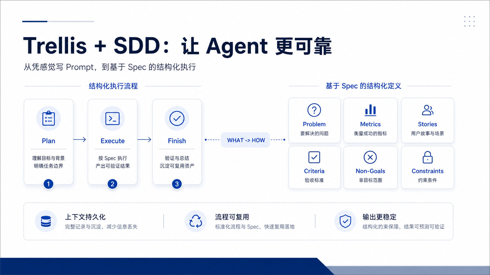

### 4.2 Trellis 解决什么问题

| 问题 | 传统做法 | Trellis 的做法 |
|---|---|---|
| 上下文臃肿 | 所有规则塞进一个文件，越写越长 | 按作用域分层，按需加载 |
| 跨会话遗忘 | 决策停留在对话中，下次丢失 | 写入 journal 和任务目录，持久化 |
| 范围失控 | Agent 容易自行扩展功能 | Spec 显式声明 Non-Goals |
| 经验无法复用 | 每次都从零开始 | Finish 阶段将经验写回 Spec |
| 工具锁定 | 提示词绑死在某个工具上 | 配置器模式，一套知识适配多种工具 |

### 4.3 工作原理

Trellis 的原理可以从三个维度理解：四层知识结构、三阶段工作流、以及 SDD 方法论。

**四层知识结构：**

- `Spec`：团队级规范，沉淀稳定约束、编码标准与架构边界
- `Tasks`：任务级上下文，包含 PRD、实现上下文（`implement.jsonl`）、审查上下文（`check.jsonl`）
- `Workspace`：个人或会话级工作区日志，用于跨会话承接决策与记录
- `Workflow`：共享工作流定义，明确任务当前所处阶段及下一步动作

| 层级 | 作用域 | 主要价值 |
|---|---|---|
| Spec | 团队级 | 保证长期一致性 |
| Tasks | 任务级 | 保证单任务边界清晰 |
| Workspace | 会话级 | 保证跨 run 连续性 |
| Workflow | 流程级 | 保证执行路径可重复 |

**三阶段工作流：**

- `Plan`：创建任务、澄清需求、形成 PRD 或 Spec
- `Execute`：基于注入的上下文实施变更并完成质量检查
- `Finish`：执行评审、归档经验、沉淀规范

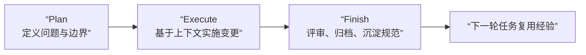

**SDD 方法论：**

SDD（Spec-Driven Development）是 Trellis 背后的方法论支撑，核心理念：**人定义 WHAT，AI 实现 HOW。**

Spec 必须包含六要素，且粒度可以通过一个自检标准验证：如果换一个技术栈实现，Spec 是否仍然有效？如果否，说明混入了 HOW（实现细节），应移到 Plan 中。

| Spec 六要素 | 主要回答的问题 | 作用 |
|---|---|---|
| Problem Statement | 为什么要做 | 明确任务目标 |
| Success Metrics | 什么叫成功 | 提供量化判定标准（”P95 < 200ms” 而非”要快”） |
| User Stories | 谁在什么场景使用 | 保持业务语义清晰 |
| Acceptance Criteria | 如何验收 | 支撑机械化验证 |
| Non-Goals | 明确不做什么 | 防止范围失控 |
| Constraints | 有哪些边界条件 | 约束实现路径 |

| 对比项 | 只靠自然语言 Prompt | 基于 SDD 的结构化方式 |
|---|---|---|
| 任务边界 | 容易漂移 | 相对稳定 |
| 结果验收 | 依赖主观判断 | 可按标准核对 |
| 知识复用 | 难沉淀 | 可回写为规范 |
| 协作交接 | 依赖记忆 | 依赖文件与流程 |

## 五、Multica + Trellis 的联合工作流

### 5.1 从 Spec 到验证结果的闭环

在实际使用中，Multica 与 Trellis 的结合方式并不复杂。比较稳定的路径是：先定义 Spec，再补充 Plan，然后将任务放入 Multica 的 Issue 流程中，由不同 Agent 基于各自职责继续执行。

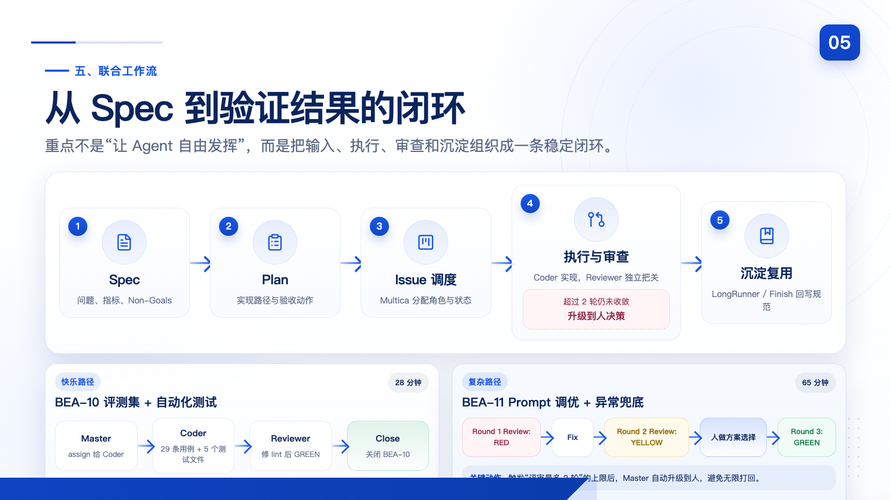

一条典型闭环遵循 **Spec → Plan → 执行 → 审查 → 沉淀** 的路径。核心在于不是”让 Agent 自由发挥”，而是将输入、执行和验证组织成结构化闭环。

**真实任务走读（两个任务，两种路径）：**

以下是我实际项目中的两个连续任务，展示了快乐路径和复杂路径。

**任务 1：评测集 + 自动化测试（BEA-10，28 分钟）**

这是快乐路径——一个 round 就过：

1. Master assign 给 Coder：编写 29 条评测用例和 5 个测试文件
2. Coder 完成，汇报分支 `969893cf`
3. Master assign 给 Reviewer
4. Reviewer 审查 102 条测试，发现 lint 问题直接修复，审查通过（GREEN）
5. Master 关闭 BEA-10

> 踩坑：代码最终停留在 reviewer 分支，没合入 main。后来我在提示词里加了”审查通过后必须合入 main”的硬规则。

**任务 2：Prompt 调优 + 异常兜底（BEA-11，65 分钟）**

这是复杂路径——走了 3 轮审查 + 人工升级决策：

1. Master assign 给 Coder：重构 SystemPrompt、优化 SKILL.md
2. Coder 完成，汇报分支 `81078328`
3. **Round 1 Review**：Reviewer 发现订单号格式错误（SO+8 vs SO+11）、测试空壳、PROMPT 重复 → **RED 不通过**
4. **Round 1 Fix**：Coder 修正订单号格式、补充测试断言
5. **Round 2 Review**：仍有 lint、await、命名问题 → **YELLOW 有遗留**
6. **迭代上限触发**：已达 2 轮，Master 升级到人决策
7. 人选择方案 B（修复后继续），Master 继续 assign Coder
8. **Round 3 Fix + Review**：修复通过（GREEN）
9. **Round 4 最终优化**：补充非阻塞断言
10. 人审批合并 PR#10
11. LongRunner 知识提取 + 验证收口（16/16 异常测试通过）
12. Master 关闭 BEA-11，向父 issue 汇报整体进度

这两个任务的关键差异：任务 1 全自动，我完全不用介入；任务 2 在迭代上限处需要我做一次决策，但决策之后 Agent 继续自主推进到完成。

| 阶段 | 由谁主导 | 主要产物 | 目标 |
|---|---|---|---|
| 任务定义 | 人 | Spec / Plan | 明确边界与验收标准 |
| 平台调度 | Multica | Issue / 状态 / 分配关系 | 组织协作流程 |
| 任务执行 | Coder | 代码、测试、执行记录 | 完成实现 |
| 独立评审 | Reviewer | 审查结论、修改意见 | 保证质量门禁 |
| 收口沉淀 | 人 / LongRunner | 经验、规范补充 | 形成可复用资产 |

### 5.2 角色分工与执行隔离

在实际协作中，可以将多 Agent 协作抽象为若干稳定角色：

- `Master Orchestrator`：任务调度与状态收口，不直接编写业务代码
- `Coder`：代码实现、测试执行和快速问题响应
- `Reviewer`：代码审查、测试审查与质量门禁把控
- `LongRunner`：长周期任务、调研与中文文档输出

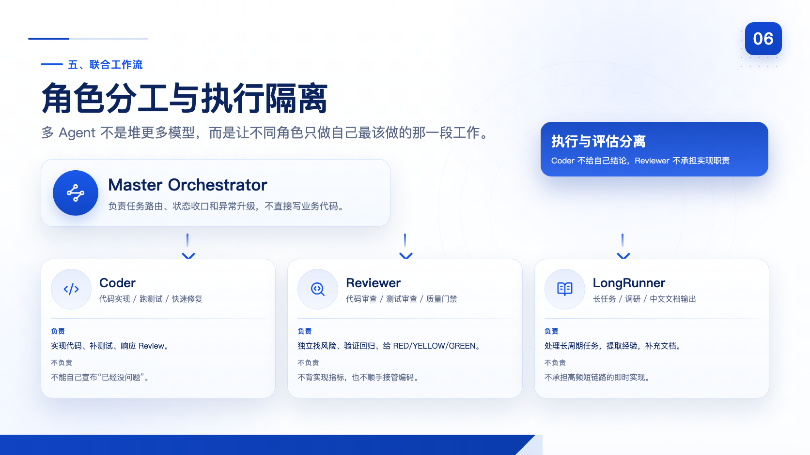

其中最关键的工程原则是：**执行与评估分离。** 编码者不审查自己的代码，设计者不审查自己的方案，执行角色与评审角色必须分离。对于 AI Agent 而言，这一原则比人工协作中更加重要，因为它直接关系到输出质量能否被独立校验。

| 角色 | 主要职责 | 不负责的内容 | 设立原因 |
|---|---|---|---|
| Master Orchestrator | 调度、路由、收口 | 不直接写业务代码 | 避免协调与执行混杂 |
| Coder | 实现代码、运行测试 | 不独立给自己结论 | 防止自我确认偏差 |
| Reviewer | 审查代码与测试 | 不承担实现职责 | 保持评估独立性 |
| LongRunner | 长任务、调研、文档 | 不承担高频短链路实现 | 适配不同任务类型 |

## 六、实践经验：五个踩过的坑

理论框架搭好后，真正决定体验的是运行中的细节。以下五个坑都是我实际遇到的，每一条都对应提示词体系里后来加上的硬规则。

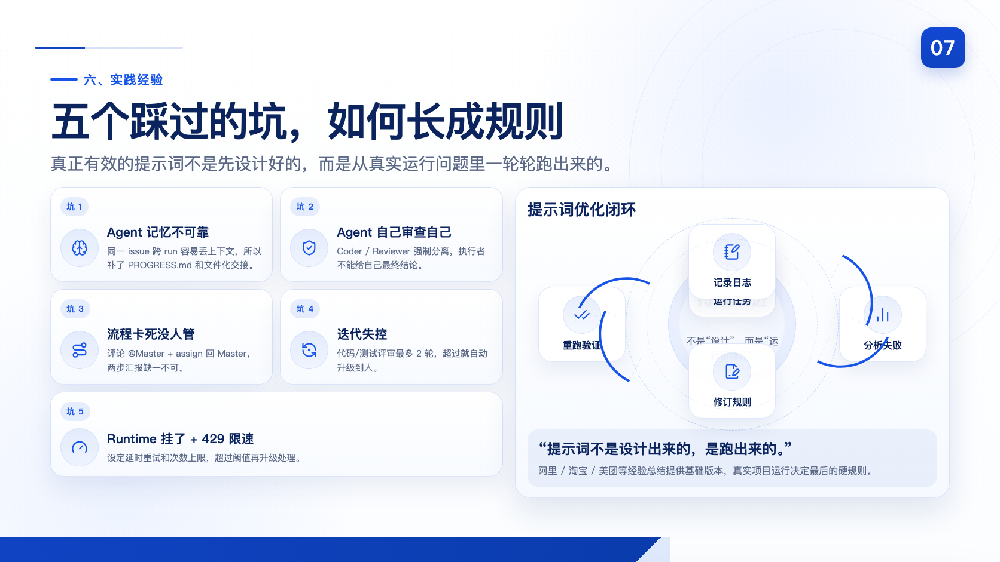

### 6.1 坑一：Agent 记忆不可靠

Agent 做完一个任务，下一个任务完全不记得之前做过什么。更糟糕的是，同一个任务的两次 run 之间（比如 Coder 写完被 Reviewer 打回后重新 assign），Agent 也可能丢失上下文，重复已完成的工作。

**平台帮了什么**：Multica 同一 agent 在同一 issue 上自动恢复 session；Trellis 把 PRD、`implement.jsonl`、`check.jsonl` 持久化到文件。

**我自己补的约定**：`PROGRESS.md`——每次 run 结束必须更新（已完成/未完成/问题/下一步），下次 run 开始先读取。这不是 Multica 或 Trellis 的原生机制，但这一层约定显著降低了跨 run 丢失信息的概率。

| 上下文机制 | 是否原生 | 所属范围 | 主要作用 |
|---|---|---|---|
| Issue 评论与状态流转 | 是 | Multica | 承接任务进度与交接信息 |
| session 恢复 | 是 | Multica | 延续同一 Issue 内的执行上下文 |
| PRD / implement.jsonl / check.jsonl | 是 | Trellis | 将任务上下文化为结构化文件 |
| workspace journal | 是 | Trellis | 保留跨会话日志与决策 |
| PROGRESS.md | 否 | 本地补充约定 | 强化跨 run 的人工可读交接 |

### 6.2 坑二：Agent 自己审查自己

早期让同一个 Agent 写完代码就自己 review。结果——它永远觉得自己写的是对的，审查形同虚设。

**提示词里的规则**：**执行与评估分离。** 编码者不审查自己的代码，设计者不审查自己的方案。Coder 和 Reviewer 严格分成两个 Agent。

### 6.3 坑三：流程卡死没人管

遇到过好几次：Agent 完成了任务，发了评论汇报，但 mention 格式写错了（用了纯文本 @ 而不是 markdown 链接格式），Master 没被触发，整个流程就卡在那里。还有一次是 Agent 完成工作但忘了 assign 回 Master。

**提示词里的规则**：**两步汇报，缺一不可。** 子 Agent 完成任务后必须：1）发评论 + @Master（传上下文）；2）assign 回 Master（保证触发）。即使 mention 格式有误，assign 也能确保 Master 被唤醒。同时 Master 被触发时第一件事是检查 issue 完整状态，发现漏了 mention 就直接继续调度——这套”断流恢复”机制专门对付流程卡死。

### 6.4 坑四：迭代失控

Reviewer 打回 → Coder 修 → 再打回 → 再修……循环五次还在扯。每次都发现新问题，但永远修不完。

**提示词里的规则**：代码/测试评审最多 2 轮。超过上限自动升级到人来看。这条硬性上限就是从反复打回五次的惨痛经历中提炼出来的。前面讲到的 BEA-11 就真实触发了这个上限——Round 2 仍有遗留时，Master 自动 @人 让我做决策。

### 6.5 坑五：Runtime 挂了 + 429 限速

Agent 正在跑，突然 daemon 断了，任务直接 failed，没人接手。或者模型 API 限速，Agent 被拒绝后直接报错退出。

**平台帮了什么**：Multica 原生支持 runtime offline 后重新 dispatch，daemon 重启时回收孤儿任务。

**提示词里的规则**：Master 检测到 runtime 故障后，等 30 秒重新 assign，最多自动重试 2 次，第 3 次升级到人。遇到 429 限速，等待 60 秒后重试，最多 5 次，5 次失败后汇报 Master 请求指示。

### 这些规则是怎么来的

先交代一下背景——我给 Agent 写的那套提示词，不是凭空设计出来的。做法是：把阿里、淘宝、美团等技术公众号上关于 AI Agent 协作开发的相关文章收集起来，喂给模型，让它总结出一个基础版本。然后我在 Multica 上实际跑项目，根据运行中遇到的真实问题，一轮一轮地优化。

所以上面每个坑，都是实际运行中遇到的问题，对应的规则是为了解决这些具体问题加进去的。**提示词不是设计出来的，是跑出来的。**

## 七、结论

综合来看，Multica、Trellis 与 SDD 分别覆盖了多 Agent 协作、单 Agent 可靠执行以及结构化任务定义三个层面。三者叠加后，能够形成一条较完整的工程路径：以 Spec 约束目标，以 Plan 约束实施，以平台组织协作，以角色分离控制质量，以持续复盘沉淀规范。

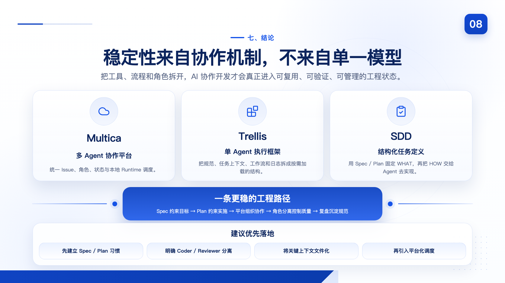

本次分享希望形成的核心结论如下：

- Multica 适合作为多 Agent 协作平台，用于统一任务、角色与状态管理
- Trellis 适合作为单 Agent 上下文与工作流管理框架，用于减少记忆漂移和执行失控
- SDD 为 Agent 协作提供清晰边界，使输入、执行和验收具备更强的结构化特征
- 稳定性并不来自单一模型能力，而来自角色拆分、质量门禁、文件化上下文和持续优化

对于团队实践而言，最值得优先落地的并不是“更多模型”，而是“更稳定的协作机制”。当工具、流程和角色被清晰拆分之后，AI 才更可能成为可复用、可验证、可管理的工程执行力量。

| 建议优先落地项 | 优先级 | 原因 |
|---|---|---|
| 先建立 Spec / Plan 习惯 | 高 | 决定后续执行边界是否稳定 |
| 明确 Coder / Reviewer 分离 | 高 | 直接影响质量门禁 |
| 将关键上下文文件化 | 高 | 降低跨轮丢失信息的概率 |
| 引入平台化任务调度 | 中 | 提升并行能力与状态可见性 |
| 持续优化提示词体系 | 中 | 随真实任务逐步收敛规则 |
